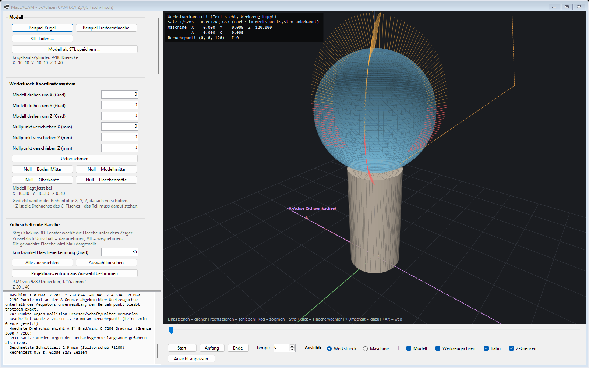
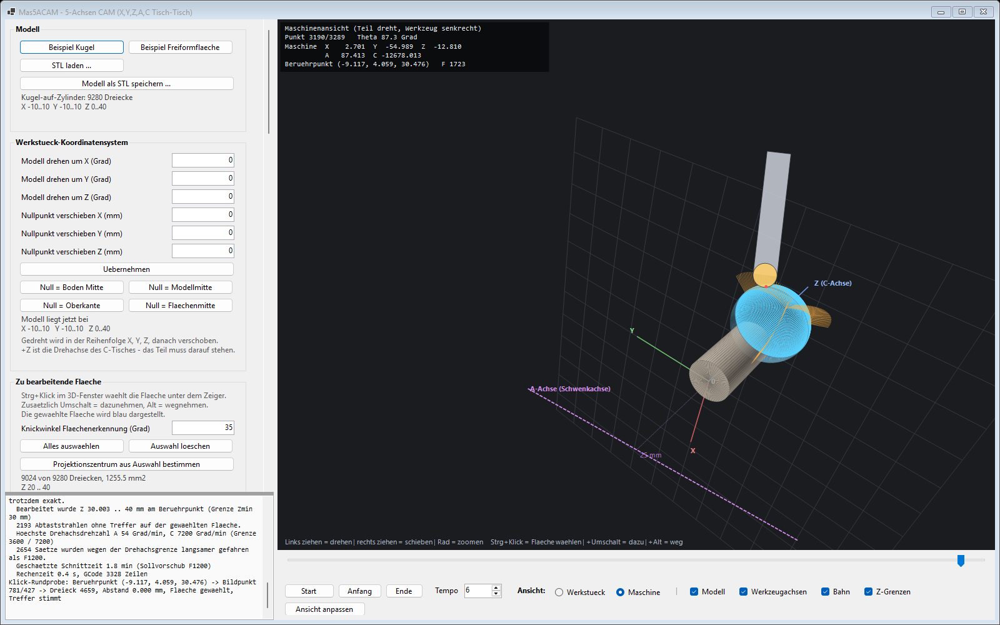
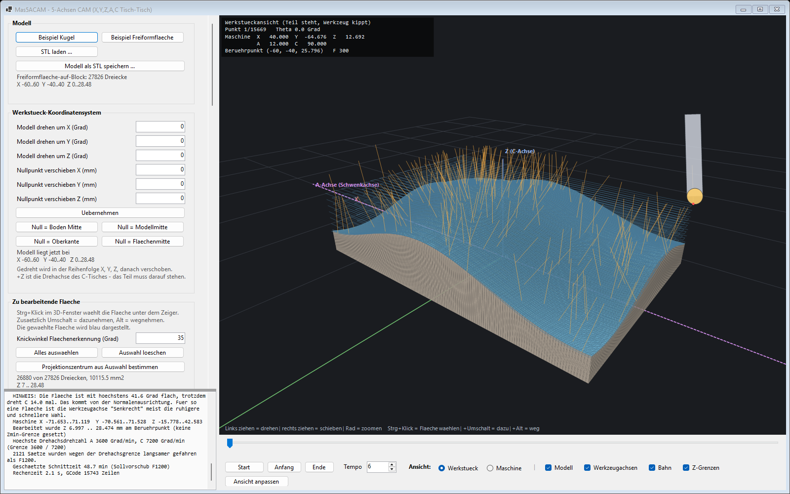
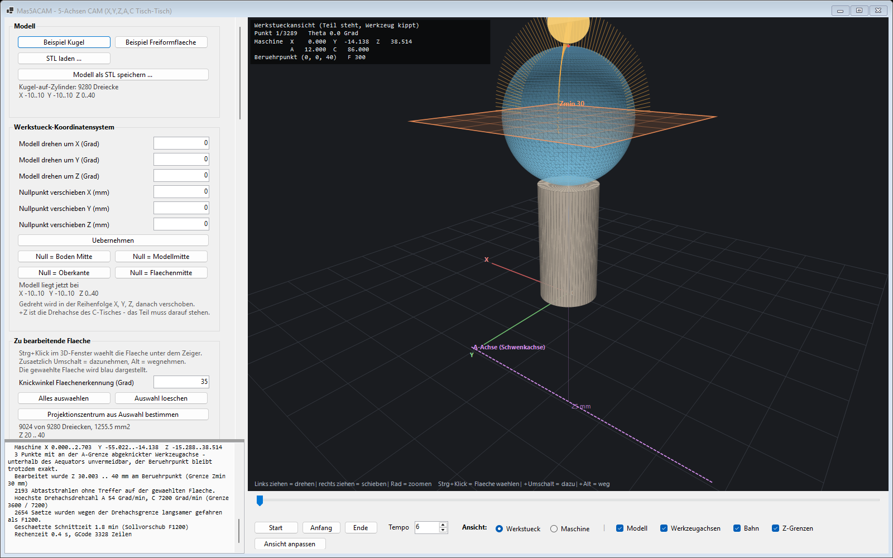
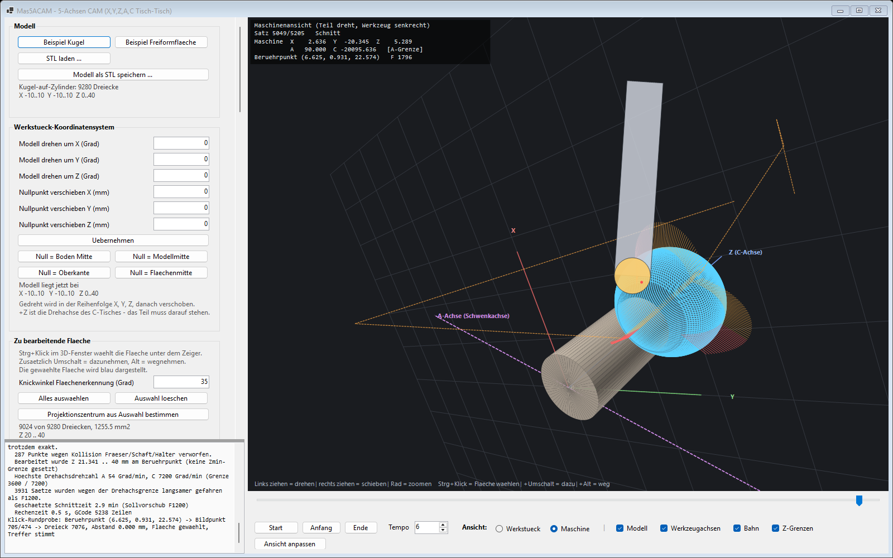
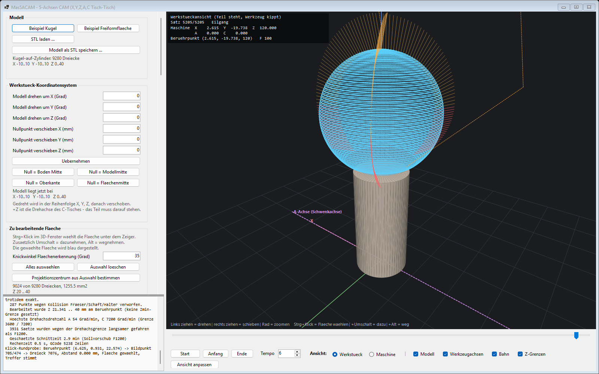

# Mas5ACAM – 5-Achsen-CAM für X, Y, Z, A, C (Tisch-Tisch)

Windows-Desktop-Anwendung (C# / .NET 10, WinForms), die aus einem 3D-Modell einen
**simultanen 5-Achs-Werkzeugweg** berechnet und daraus ein GCode-Programm schreibt.
Die 3D-Darstellung ist ein eigener Software-Renderer auf GDI+ – **keine NuGet-Pakete,
keine externen Abhängigkeiten**, gleiche Bauart wie `Code Projects\GCodeViewer`.
Projektseite: https://masdrive.ch/myprojects/projects/mas5acam/



---

## 1. Die Maschine

| Achse | Art | Bereich | Bemerkung |
|---|---|---|---|
| X, Y, Z | linear | frei | Spindel steht fest, Werkzeugachse zeigt in Maschinen-Z nach unten |
| A | rotatorisch um X | **−90° … +90°** | Schwenkbrücke, trägt den C-Tisch |
| C | rotatorisch um Z | **endlos** | Rundtisch, trägt das Werkstück |

Kinematikkette: `Maschine → A → C → Werkstück` (Tisch-Tisch).
Alle fünf Achsen laufen simultan.

**Programm-Nullpunkt ist der Werkstück-Nullpunkt**: Mitte C-Tisch auf der
Tischoberfläche, angetastet in der Ausgangsstellung A = C = 0. Genau dort setzt man in der
Praxis G54.

Der Parameter *Tischoberfläche über A-Achse* sagt der App, wie weit der Drehtisch über der
A-Achse sitzt (bei vielen Maschinen 25 mm). Dieser Wert geht **ausschliesslich in die
Kinematik** ein – er beschreibt, wie weit der Nullpunkt beim Schwenken von A ausholt. Die
ausgegebenen Koordinaten verschiebt er nicht:

| Fall | Tisch 0 mm über A | Tisch 25 mm über A |
|---|---|---|
| Punkt 10 mm über dem Tisch, A = C = 0 | Z10 | **Z10** (nicht Z35) |
| Nullpunkt selbst bei A = 0 | X0 Y0 Z0 | X0 Y0 Z0 |
| Nullpunkt bei A = 90° | X0 Y0 Z0 | X0 **Y−25 Z−25** |

Die letzte Zeile ist der eigentliche Zweck des Werts: beim Schwenken wandert der Nullpunkt
um den Drehpunkt, und die Linearachsen müssen das ausgleichen.

**Die A-Achse ist im 3D-Fenster eingeblendet** – magenta gestrichelt, waagrecht in X, um
den Tischversatz unter dem Nullpunkt, dazu die Strecke vom Nullpunkt zur Achse mit ihrem
Mass. Sie ist maschinenfest und dreht deshalb nicht mit: in der **Maschinenansicht** sieht
man beim Abspielen unmittelbar, dass das Werkstück um sie schwenkt und nicht um die
X-Achse durch den Nullpunkt.



Nachgerechnet über den ganzen Schwenkbereich: der Abstand des Nullpunkts zur A-Achse
bleibt konstant bei 25,0000 mm, der zur X-Achse schwankt zwischen 0 und 35,4 mm. Das Teil
dreht also um die A-Achse.

**Was im 3D-Fenster orange ist, lässt sich einzeln abschalten.** Zwei Dinge werden orange
gezeichnet: die kurzen Striche der Werkzeugachse (Haken *Werkzeugachsen*) und die
gestrichelten Eilgänge und Verbindungswege zwischen den Bahnen (Haken *Eilgänge*). Bei
einem komplexen Modell mit vielen Bahnen legen sich vor allem die Eilgänge als Netz über
das ganze Teil und verdecken die blaue Schnittbahn. Beide Haken sitzen in der
Animationsleiste unter dem 3D-Fenster; der Haken *Bahn* heisst jetzt *Schnittbahn*, weil
er nur noch die blaue Bahn am Berührpunkt meint.

**Drehung und Nullpunkt wirken sofort.** Eine Eingabe in *Modell drehen um X/Y/Z* oder
*Nullpunkt verschieben* dreht das Modell unmittelbar – kein Knopfdruck nötig. Damit bei
grossen Netzen nicht jeder einzelne Tastendruck eine Neuberechnung auslöst, sammelt ein
Nachlauf von 250 ms die Eingabe ein. Eine halb getippte Zahl wie `-` wirft den Wert nicht
auf 0 zurück, sondern behält den letzten gültigen Stand, bis die Zahl vollständig ist.
Ein bereits berechneter Werkzeugweg gehört zur alten Lage und wird beim Drehen verworfen.

**Die Maschinendaten bleiben erhalten.** Achsgrenzen, Tischversatz, Maschinen-Z0,
Achsvorschübe und Drehrichtungen beschreiben die Maschine, nicht das Werkstück. Die
Schaltfläche **Maschinendaten speichern** legt sie in
`%AppData%\Mas5ACAM\maschine.cfg` ab – eine schlichte Textdatei, eine Zeile je Wert.
Beim Start werden sie automatisch geladen; **Wieder laden** holt sie nach einem Versuch
zurück. Geschrieben wird nur auf Knopfdruck, damit ein Versuch mit anderen Werten die
eingefahrene Einstellung nicht stillschweigend überschreibt.

**Drehsinn** – intern wird durchgehend nach der Rechte-Hand-Regel gerechnet:
A+ dreht Werkstück-Z nach Maschinen-**−Y**, C+ dreht Werkstück-X nach Werkstück-+Y.
Dreht deine Maschine eine Achse andersherum, setze *A-Drehrichtung umkehren* bzw.
*C-Drehrichtung umkehren*. Das kehrt nur das Vorzeichen im GCode um; die berechnete
Bewegung bleibt dieselbe. **Diese Einstellung vor dem ersten Einfahren prüfen.**

---

## 2. Beispielmodell

Beim Start erzeugt die App das vorgegebene Beispiel:

* Zylinder ⌀10 mm, Länge 20 mm, entlang Z, eingespannt bei X = Y = Z = A = 0
* Kugel ⌀20 mm, tangential aufgesetzt, **Mittelpunkt bei Z = 30**, Scheitel bei Z = 40
* die **Kugel ist als zu bearbeitende Fläche vorgewählt** (blau), der Zylinder ist
  Aufspannung und bleibt unberührt

Ein zweites Beispiel deckt den anderen Fall ab: **Block 120 × 80 mm mit welliger
Freiformfläche** obenauf, auf der C-Achse zentriert. Auch dort ist nur die Wellenfläche
vorgewählt; Seiten und Boden sind Aufspannung. Beim Laden stellt sich die Bahnform
gleich auf *Parallelbahnen*.

Beide Modelle lassen sich als STL exportieren; umgekehrt liest die App beliebige
STL-Dateien (binär und ASCII).



---

## 3. Die zu bearbeitende Fläche auswählen

Ein STL kennt keine Flächen, nur lose Dreiecke. Damit „nur die Kugel fräsen" nicht von
Hilfskonstruktionen wie einem Radiusband abhängt, erkennt die App Flächen selbst:

**Strg + Klick** im 3D-Fenster wählt die Fläche unter dem Zeiger.
Zusätzlich **Umschalt** nimmt eine weitere Fläche dazu, **Alt** nimmt eine weg.

Dahinter steckt ein Wachstumsverfahren über die Kantennachbarschaft: vom angeklickten
Dreieck aus wird so lange über gemeinsame Kanten weitergelaufen, wie der Winkel zwischen
den Facettennormalen unter dem **Knickwinkel** (Vorgabe 35°) bleibt. An einer echten
Kante hört die Fläche auf – genau dort, wo das Auge sie auch enden sieht.

Am Beispiel:

| Klick auf | Ergebnis |
|---|---|
| Kugel | 9024 Dreiecke – die ganze Kugel, **kein einziges Zylinderdreieck** |
| Zylindermantel | 128 Dreiecke – Deckel und Boden bleiben aussen (90°-Kante) |
| Zylindermantel bei 120° Knickwinkel | 256 Dreiecke – die Auswahl läuft über die Kanten |
| Wellenfläche des Blocks | 26 880 Dreiecke – Seiten und Boden bleiben aussen |

Die gewählte Fläche wird **blau** dargestellt, der Rest grau. Bei der Bahnberechnung
zählt nur sie: trifft ein Abtaststrahl zuerst etwas anderes, ist die Fläche dort verdeckt
und es entsteht kein Bahnpunkt. Ohne Auswahl gilt das ganze Modell als bearbeitbar.

**Projektionszentrum aus Auswahl:** nach jeder Auswahl legt die App eine
**Ausgleichskugel** durch die gewählten Dreiecke (kleinste Fehlerquadrate). Passt sie
gut, werden Mittelpunkt und Radius als Projektionszentrum übernommen – beim Beispiel
exakt `(0, 0, 30)` mit r = 10,000 mm bei 0,000 mm mittlerer Abweichung. Passt sie nicht,
wird der Flächenschwerpunkt gesetzt und im Protokoll darauf hingewiesen.

---

## 4. Wo X, Y und Z liegen

Ein STL bringt sein eigenes Koordinatensystem mit, das selten zur Aufspannung passt. Die
Gruppe *Werkstück-Koordinatensystem* richtet das Modell aus:

* **Modell drehen um X / Y / Z** (Grad) – in dieser Reihenfolge
* **Nullpunkt verschieben X / Y / Z** (mm) – danach angewandt
* Schaltflächen **Null = Boden Mitte**, **Null = Modellmitte**, **Null = Oberkante** und
  **Null = Flächenmitte** (Mittelpunkt der Ausgleichskugel der gewählten Fläche)

Das Ergebnis ist das Werkstück-Koordinatensystem:

* Ursprung (0,0,0) = Werkstück-Nullpunkt auf der Tischoberfläche
* **+Z = Drehachse des C-Tisches**, zeigt nach oben zur Spindel
* +X, +Y = Tischebene bei C = 0

Weil +Z die Tischdrehachse ist, muss das Teil auf dieser Achse stehen – die
Nullpunkt-Schaltflächen setzen deshalb immer einen mittigen Punkt.

Im 3D-Fenster sind **X, Y und Z (C-Achse) beschriftet** und der Nullpunkt mit `0`
markiert. Die Achsenlänge passt sich dem Modell an.

Die Flächenauswahl übersteht jede Änderung von Drehung und Nullpunkt: die
Dreiecksreihenfolge bleibt erhalten, also bleibt die Auswahlmaske gültig.

> Die **Linearachsen der Maschine** sind dagegen durch die Kinematik festgelegt – die
> Spindel steht in Maschinen-Z, A dreht um X, C um Z. Was sich einstellen lässt, ist die
> Drehrichtung von A und C (Abschnitt 1) und die Höhe der Tischoberfläche über der
> A-Achse.

---

## 5. Wie die Bahn entsteht

### 5.0 Welche Bahnform zu welchem Teil passt

| Bahnform | Wofür | Kennt Z-Zustellung |
|---|---|---|
| **Spirale** | Kugel- und kuppelartige Flächen, die von einem Punkt aus sternförmig sichtbar sind | nein |
| **Breitenkreise** | dasselbe, aber als einzelne Ringe statt einer durchgehenden Spirale | nein |
| **Parallelbahnen** | **Freiformflächen auf einem Block** – Raster von oben in Z projiziert | **ja** |

Die untere Bearbeitungsgrenze **Zmin** gilt dagegen für alle drei.

Die Bahnform wird oben im Abschnitt *Strategie* gewählt; die Felder darunter sind je nach
Wahl aktiv oder ausgegraut.

### 5.0.1 Zmin: bis wohin nach unten bearbeitet wird

**Zmin begrenzt, welcher Teil der gewählten Fläche bearbeitet wird** – gemessen in der
**Ausgangsposition**, also im Werkstück-Koordinatensystem vor jeder A/C-Drehung.
Angefahren werden nur Berührpunkte mit z ≥ Zmin. Gilt für alle Bahnformen.

Das klassische Beispiel: Kugel als Fläche gewählt, Zmin auf die Kugelmitte gesetzt – dann
wird **nur die obere Halbkugel** gefräst. Aus 5195 Bahnpunkten werden 3289, und die Bahn
endet exakt am Äquator.



**Es ist keine Schranke für das Werkzeug.** An einer steilen Flanke hängt die Fräserkugel
zwangsläufig unter ihrem Berührpunkt – am Äquator der Beispielkugel liegt ihr tiefster
Punkt bei 27,0 mm, also 3 mm unter Zmin. Das muss sie dürfen, sonst liesse sich der
Äquator gar nicht schlichten. Begrenzt wird die *Fläche*, nicht die Werkzeuglage.

**Die Ebene wird eingeblendet**, orange und beschriftet, damit sich der Wert prüfen lässt –
**sofort beim Tippen**, nicht erst bei der Bahnberechnung. Nur in der Werkstückansicht: in
der Maschinenansicht ist das Teil gedreht, eine waagrechte Z-Ebene wäre dort schief. Der
Haken *Z-Grenzen* in der Bedienzeile blendet sie aus.

> **Warum es kein Zmax gibt.** Eine *obere* Bearbeitungsgrenze wäre beim Fräsen von oben
> ohne Nutzen: was oben nicht bearbeitet werden soll, gehört nicht in die gewählte Fläche.
> Der Wert, den man an dieser Stelle wirklich braucht, ist ein anderer – die
> Rohteil-Oberkante, siehe unten. Beides war früher in einem Feld „Zmax" vermischt.

### 5.0.2 Rohteil-Oberkante und Z-Zustelltiefe (nur Parallelbahnen)

Die **Rohteil-Oberkante** sagt, ab welcher Höhe Material ansteht. Automatisch ist das der
höchste Punkt der gewählten Fläche – dann gibt es nichts abzutragen, was über der Fläche
liegt. Trägt man einen höheren Wert ein, steht dort Rohmaterial: daraus entstehen
zusätzliche Schruppebenen, und die Bearbeitung beginnt entsprechend höher. Beim
Freiform-Beispiel mit 6 mm Rohmaterial werden aus 8 Ebenen deren 11.

Die **maximale Z-Zustelltiefe** legt fest, wie viel eine Ebene höchstens zustellt; daraus
ergibt sich ihre Zahl. Die Ebenen liegen gleichmässig von der Rohteil-Oberkante abwärts –
nicht die letzte als Rest.

Die tiefste Schruppebene liegt **eine Zustellung über der unteren Grenze**, nicht auf ihr:
eine Ebene genau dort würde einen flachen Boden fräsen, wo die Fläche tiefer liegt.

**Die letzte Bahn ist immer die freie Schlichtbahn auf der Fläche.**


**Zickzack** verbindet aufeinander folgende Rasterzeilen direkt, solange der Sprung nicht
grösser als zwei Zustellungen ist. Eine Ebene, die nirgends greift, lässt die App weg.

### 5.0.3 Woher der Bahnabstand kommt

Der seitliche Abstand der Bahnen wird **gerechnet, nicht eingestellt** – aus der
Restmaterialhöhe (Scallop), die zwischen zwei Bahnen stehen bleibt. Für eine ebene Fläche
und einen Kugelfräser mit Radius R gilt

```
h = R − √(R² − (s/2)²)     →     s = 2·√(2·R·h − h²)
```

Bei R3 und h = 0,01 mm sind das **0,489 mm**. Auf einer gewölbten Fläche fällt der Abstand
kleiner aus; die Spiralstrategie rechnet dort mit dem Ersatzradius
`1/R_eff = 1/R_Fräser + 1/r_Fläche`.

| | Wonach | Beispiel |
|---|---|---|
| **Schlichten** | Restmaterialhöhe | 0,489 mm bei R3 und h = 0,01 mm |
| **Schruppen** (nur Parallelbahnen) | Anteil des Werkzeugdurchmessers | 2,4 mm bei 0,4 · D6 |

Beide Werte stehen nach dem Rechnen **im Protokoll**, damit sie nicht unsichtbar in der
Formel stecken:

```
Bahnabstand aus Scallop 0.01 mm bei R3: 0.4895 mm auf ebener Flaeche
Bahnabstand quer: Schlichten 0.4895 mm, Schruppen 2.4 mm (0.4 x D6)
```

Wer den Abstand aus anderen Gründen festlegen will – Oberflächenbild, Taktzeit – setzt den
Haken **Bahnabstand stattdessen direkt vorgeben** und trägt ihn in mm ein. Dann wird der
Scallop nicht mehr verwendet, und das Protokoll sagt das auch.

### 5.0.4 Warum die Kugel fallen gelassen wird

Für die Ebenenschnitte reicht es **nicht**, den Flächenpunkt senkrecht unter dem Werkzeug
zu betrachten und den Fräser auf die Ebene zu setzen. Die Schneidkugel hat Radius R, also
kann sie **seitlich** in eine ansteigende Flanke schneiden, obwohl direkt unter ihr noch
Luft ist. Genau das passiert an jeder Flanke – in der ersten Fassung waren das bis zu
**0,66 mm Eingriff unter die Sollfläche**.

Richtig ist die Bedingung *Abstand Kugelmittelpunkt zur Fläche ≥ R*. Die App lässt die
Kugel deshalb wirklich fallen: für jedes Dreieck in Reichweite wird der tiefste zulässige
Mittelpunkt geschlossen ausgerechnet – getrennt für die drei Fälle, in denen die Kugel auf
der Dreiecksfläche, auf einer Kante oder auf einer Ecke zu liegen kommt – und über alle
Dreiecke das Maximum genommen (`BallDrop.cs`). Damit misst der Selbsttest **0,0000 mm**
Eingriff unter die Sollfläche.

### 5.0.5 Werkzeugachse: Flächennormale oder senkrecht

Die Werkzeugachse folgt normalerweise der Flächennormale – das ist der 5-Achs-Fall. Für
eine flache Freiformfläche ist das aber nicht immer klug: beim Freiform-Beispiel steht die
Fläche höchstens 41° schräg, trotzdem dreht die C-Achse **14 Umdrehungen**, nur weil sich
die Richtung der Normale ändert.

Deshalb gibt es die Einstellung **Werkzeugachse**:

* *Flächennormale (5 Achsen)* – A und C folgen der Fläche
* *Senkrecht (A und C stehen)* – das Werkzeug bleibt vertikal, A = C = 0

Die App weist im Protokoll darauf hin, wenn eine flache Fläche die C-Achse unnötig oft
dreht.

### 5.1 Abtastung – Kugelkoordinaten-Projektion

Aus einem Projektionszentrum (beim Beispiel der Kugelmittelpunkt `0,0,30`, siehe
Abschnitt 3) wird die Fläche in Richtung (θ, φ) abgetastet: θ = 0° ist der Nordpol,
θ = 90° der Äquator. Der Strahl startet **ausserhalb** des Modells und läuft nach innen;
der erste Treffer ist die Aussenhaut in dieser Richtung. Gehört das getroffene Dreieck
nicht zur gewählten Fläche, entsteht dort kein Bahnpunkt – so bleibt der Zylinder
unberührt. Ein Radiusband steht zusätzlich zur Verfügung, ist aber ausgeschaltet, weil
die Flächenauswahl den Job sauberer erledigt.

* **Zustellung** aus der gewünschten Restmaterialhöhe *h* (Scallop). Bei konvexer Fläche
  gilt mit `1/R_eff = 1/R_Fräser + 1/r_Fläche`: `Zustellung = √(8 · R_eff · h)`.
  Für R3 auf r10 bei h = 0,01 mm sind das 0,43 mm.
* **Punktabstand** aus der Sehnentoleranz, begrenzt durch den maximalen Winkelschritt.
* **Bahnform** *Spirale* (durchgehend vom Pol nach unten, eine C-Umdrehung je Zustellung)
  oder *Breitenkreise* (einzelne Ringe mit Zustellung dazwischen).

Die Normale kommt nicht aus der Facette, sondern aus **geglätteten Eckennormalen**
(baryzentrisch interpoliert, Knickwinkel 40° erhält scharfe Kanten). Das ist der
Unterschied zwischen 0,3° und 12° Normalenfehler in Polnähe – und damit zwischen einer
ruhigen und einer zappelnden A/C-Bewegung.

### 5.2 Werkzeuglage

Für einen **Kugelfräser** gilt die zentrale Beziehung

```
Kugelmittelpunkt = Berührpunkt + R · Flächennormale
```

Der Mittelpunkt liegt also immer auf der um R versetzten Fläche – **unabhängig davon,
wie das Werkzeug geneigt ist**. Die Neigung entscheidet nur über Erreichbarkeit und
Freigang, nie über die Genauigkeit. Die Werkzeugspitze, die im GCode steht, ist dann
`Mittelpunkt − R · Werkzeugachse`.

Die Werkzeugachse folgt der Flächennormale, um den **Voreilwinkel** (Vorgabe 12°) in
Bahnrichtung gekippt. Der Voreilwinkel hat zwei Aufgaben: er hält den Schnitt vom toten
Zentrum des Fräsers weg, und er entschärft die C-Singularität am Pol, wo die
Normalenrichtung sonst unbestimmt wäre.

### 5.3 Rückwärtskinematik

Gesucht ist die Achsstellung, die die im Werkstück gewünschte Werkzeugachse
`t = (i, j, k)` parallel zur Spindel stellt, also `R_A(A) · R_C(C) · t = (0,0,1)`:

```
C = atan2(i, j)
A = atan2(√(i² + j²), k)
```

Es gibt immer zwei Lösungen – `(A, C)` und `(−A, C + 180°)`. Gewählt wird die
zulässige und, bei Gleichstand, die mit dem kürzeren Weg. C wird stetig ausgewickelt
und läuft im Beispiel über **57,8 Umdrehungen** durch; das darf die endlose Achse.

### 5.4 Die A-Grenze – und was sie für dieses Teil bedeutet

Aus `A = atan2(√(i²+j²), k)` folgt unmittelbar: eine Werkzeugachse mit **k < 0** (also
eine Normale, die nach unten zeigt) verlangt |A| > 90° und ist auf dieser Maschine
**nicht erreichbar**. Am Kugeläquator ist die Normale waagrecht, dort steht A genau auf
90°. Darunter kann die Achse der Normale nicht mehr folgen.

Das ist kein Rechenfehler, sondern die Maschine. Und es ist kein Beinbruch: weil der
Kugelmittelpunkt fest auf der Offset-Fläche liegt, **bleibt der Berührpunkt exakt**,
auch wenn die Achse an der Grenze abknickt. Die App knickt sie deshalb kontrolliert ab,
zählt die betroffenen Punkte und weist im Protokoll und im GCode-Kopf darauf hin. In der
3D-Ansicht sind diese Werkzeugachsen **rot** statt orange.

Im Beispiel wird so bis **θ ≈ 142°**, also 52° unterhalb des Äquators, gefräst. Weiter
unten stösst der Schaft an die Zylinder-Stirnfläche – dort greift die Kollisionsprüfung.

### 5.5 Kollision

Das Werkzeug wird als Kombination von Kapseln geprüft (exakter Abstand Strecke/Dreieck):

* Schneidkugel – darf berühren, Eingriff über die Gouge-Toleranz hinaus nicht
* Schaft ab Kugelmittelpunkt bis zur freien Länge
* Halter darüber, mit Sicherheitsabstand

Verletzte Punkte werden verworfen; die Bahn endet dort bzw. wird unterbrochen und neu
angefahren.

> **Nicht geprüft** werden Tisch, Spanner, Schwenkbrücke und Maschinenraum. Das Modell
> kennt nur Werkstück und Werkzeug.

---

## 6. Der GCode

Ausgegeben werden **fertige Maschinenkoordinaten**: die Kinematik ist im CAM gerechnet,
die Steuerung braucht **kein RTCP / TCPM / M128**. Damit läuft das Programm auf
LinuxCNC, Mach, Fanuc, Haas – überall dort, wo A und C als normale Achsen bekannt sind.

```
%
O1001 (5ACAM)
(... Kopf mit Maschine, Werkzeug, Strategie, Achsbereichen, Hinweisen ...)
(Satzaufbau: N | G | X Y Z [mm] | A C [Grad] | F - alle Achsen in jedem Satz)
(--------------------------------------------------------------------)
N10     G21 G90 G94 G17 G40 G49 G80
(Start im Maschinenraum, unabhaengig vom Werkstuecknullpunkt)
N20     G53 G0 Z-1.000
N30     T1 M6
N40     S12000 M3
N50     M8
N60     G0 A0.000 C0.000
N70     G93
(Schnitt ab Theta 0.0 Grad, 5195 Punkte)
N80     G0                     Z120.000  A0.000   C0.000
N90     G0                     Z120.000  A12.000  C86.000
N100    G0 X0.000    Y-8.940   Z120.000  A12.000  C86.000
N110    G0 X0.000    Y-8.940   Z42.060   A12.000  C86.000
N120    G1 X0.000    Y-8.940   Z39.060   A12.000  C86.000      F100.000
...
N52080  G0 X2.615    Y-19.738  Z120.000  A90.000  C-20705.134
N52090  G94
N52100  M9
N52110  M5
(Ende im Maschinenraum)
N52120  G53 G0 Z-1.000
N52130  G0 A0.000 C0.000
N52140  M30
%
```

### Anfang und Ende im Maschinenraum

Das Programm beginnt und endet mit **`G53 G0 Z-1`**. G53 fährt satzweise in
Maschinenkoordinaten, also unabhängig von jedem Nullpunkt – so startet und endet der Lauf
immer an derselben sicheren Höhe, auch wenn beim letzten Mal ein anderer Werkstücknullpunkt
gesetzt war. Am Anfang steht der Satz **vor dem Werkzeugwechsel** (erst hochfahren, dann
wechseln), am Ende **nach M5 und vor M30**.

Danach ist die Z-Lage im Werkstücksystem unbekannt. Der Postprozessor löscht deshalb seinen
modalen Merker und schreibt im nächsten Satz den Z-Wert wieder ausdrücklich aus – sonst
stünde dort ein Satz ohne Z, und die Steuerung bliebe auf der Maschinenhöhe stehen.

**Die C-Achse wird nicht zurückgekurbelt.** Am Ende eines Laufs steht sie bei mehreren
tausend Grad – beim Kugelbeispiel −20705°. Auf `C0` zu fahren hiesse, das Teil 57 Mal um
die eigene Achse zu drehen, ohne jeden Nutzen: jede volle Umdrehung führt zur selben
Stellung. Angefahren wird deshalb das **nächstgelegene Vielfache von 360°**:

```
(C auf -20880 Grad = -58 volle Umdrehungen: dieselbe Stellung wie C0, nur 174.9 Grad Weg statt 20705.1)
N52130  G0                               A0.000   C-20880.000
```

Gleiche Ausrichtung wie C0, aber höchstens 180° Weg.

Beides lässt sich im Abschnitt *Postprozessor* abschalten bzw. auf einen anderen Wert als
−1 setzen.

### Satzaufbau – jede Zeile für sich lesbar

Zwei Schalter im Abschnitt *Postprozessor* steuern die Lesbarkeit, beide sind
voreingestellt eingeschaltet:

* **Vollständige Sätze** – jede Zeile enthält G, X, Y, Z, A, C und F, auch wenn sich ein
  Wert nicht geändert hat. Man sieht jedem Satz an, wo die Maschine steht, ohne
  rückwärts suchen zu müssen, wann X zuletzt geschrieben wurde. Ausgeschaltet arbeitet
  der Postprozessor modal (nur geänderte Worte) – kürzere Datei, aber Zeile für Zeile
  nicht mehr selbsterklärend.
* **Spalten ausrichten** – die Achsworte stehen auf festen Spaltenbreiten untereinander,
  auch die Satznummer, damit die Spalten nicht von `N10` bis `N52130` wandern.
  Aufgefüllt wird immer **hinter** der Zahl, nie zwischen Adressbuchstabe und Zahl –
  das verträgt jede Steuerung.

Voll ausgeschrieben wächst die Beispieldatei von etwa 265 KB auf 400 KB. Für Steuerungen
mit knappem Programmspeicher lässt sich beides abschalten.

### Vorschub – warum G93 die Voreinstellung ist

Das Teil sitzt rotationssymmetrisch auf der C-Achse. Beim Fräsen bewegen sich die
**Linearachsen dadurch kaum** – die Schnittbewegung kommt fast vollständig aus der
C-Drehung. Im Beispiel gilt das für 5120 von 5195 Sätzen. Ein F-Wert in mm/min
beschreibt eine solche Bewegung nicht; **G93 Inverszeit** (`F = 1 / Blockzeit in
Minuten`) beschreibt sie exakt und ohne Kinematikkenntnis der Steuerung.

Wer G93 nicht nutzen kann, wählt *G94 mm/min, kompensiert*: dort wird F je Satz so
skaliert, dass am Werkstück der Sollvorschub ankommt. Die App warnt im Protokoll, wenn
die Linearachsen dominiert werden und G94 damit wenig aussagekräftig ist.

In beiden Fällen begrenzt die Blockzeit zusätzlich der **maximale Achsvorschub der
Drehachsen** (Vorgabe A 3600, C 7200 Grad/min). Ohne diese Bremse liefen die Drehachsen
in Polnähe unrealistisch schnell, weil dort der Weg am Werkstück fast null, die
C-Drehung aber gross ist.

### An- und Abfahren

Weil die Werkzeugachse im Maschinenraum immer Maschinen-Z ist, ist Abheben entlang der
Werkzeugachse schlicht **Z+**. Reihenfolge je Schnitt: auf Rückzugsebene, dann A/C
drehen, dann X/Y positionieren, dann im Eilgang bis Abhebehöhe, dann im Vorschub
eintauchen.

---

## 7. Die Oberfläche

Links die Parameter (Modell, Werkstück-Koordinatensystem, zu bearbeitende Fläche,
Werkzeug, Maschine, Strategie, Kollision, Technologie, Postprozessor) und darunter das
Protokoll, rechts die 3D-Vorschau.

**Ansicht umschalten:** unter dem 3D-Fenster, in der Zeile mit den Abspielknöpfen –
`Ansicht: ( ) Werkstueck ( ) Maschine`. Welche gerade aktiv ist, steht auch oben links
im 3D-Fenster.

Die beiden Ansichten:

* **Werkstückansicht** – das Teil steht still, das Werkzeug kippt. Die CAM-Sicht.
* **Maschinenansicht** – das Werkzeug steht senkrecht, das Teil dreht sich mit A und C,
  genau wie es die Maschine macht. **Das ist die eigentliche GCode-Kontrolle.**



Der Schieber und Start/Pause fahren **das ganze Programm** Satz für Satz ab – Eilgänge,
Anfahren, Schnitt, Abheben und die beiden G53-Rückzüge, in genau der Reihenfolge, in der
sie im GCode stehen. Die Liste entsteht beim Schreiben des GCodes, aus derselben Quelle;
Animation und Programm können deshalb nicht auseinanderlaufen. Verbindungswege sind
**orange gestrichelt** gezeichnet, die Schnittbahn cyan.

Am Ende steht das Werkzeug zurückgezogen, A und C auf 0 – so wie das Programm endet:



Wo `G53 Z-1` im Werkstück-Koordinatensystem liegt, weiss die App nur, wenn im Abschnitt
*Maschine* **Maschinen-Z0 über Nullpunkt** eingetragen ist. Ohne diesen Wert zeigt die
Animation stattdessen die Rückzugsebene und schreibt „Höhe im Werkstücksystem unbekannt"
dazu. Auf den erzeugten GCode hat der Wert keinen Einfluss.

Oben links stehen laufend Satznummer, Bewegungsart, X/Y/Z, A/C, Berührpunkt und F-Wert.

**Zmin eingeben:** Haken *Nach unten begrenzen (Zmin)* im Abschnitt *Strategie* setzen –
dann ist das Feld darunter editierbar, vorbelegt mit dem tiefsten Punkt der gewählten
Fläche. **Rohteil-Oberkante** entsprechend: Haken *Rohteil-Oberkante = höchster
Flächenpunkt* entfernen. Beide Häkchen sind immer bedienbar, unabhängig von der Bahnform.

**Alle Eingaben wirken sofort in der Vorschau** – Zmin-Ebene, Rohteil-Oberkante und die
Lage der A-Achse gehen beim Tippen mit, ohne Neuberechnung. Eine unvollständige Eingabe
(leeres Feld, blosses Minus) lässt den bisherigen Wert stehen.

Maus: links ziehen = drehen, rechts ziehen = schieben, Rad = zoomen,
**Strg+Klick = Fläche wählen** (+Umschalt = dazu, +Alt = weg). Die Flächenauswahl
funktioniert in beiden Ansichten – in der Maschinenansicht wird der Sichtstrahl dafür
durch A und C zurückgedreht.

---

## 8. Bauen und starten

```
dotnet build "Code Projects\5ACAM\Mas5ACAM.sln" -c Release
```

Ergebnis: `src\bin\Release\net10.0-windows\Mas5ACAM.exe`.
Voraussetzung: .NET-10-Desktop-Runtime. Alternativ `Mas5ACAM.sln` in Visual Studio öffnen.

Optionale Startparameter:

```
Mas5ACAM.exe teil.stl                 STL beim Start laden
Mas5ACAM.exe --shot bild.png [stl]    Diagnose: rechnen, zwei PNG ablegen, beenden
```

---

## 9. Selbsttest

Der Rechenkern lässt sich ohne Oberfläche prüfen:

```
dotnet run --project "Code Projects\5ACAM\selftest\Selftest.csproj" -c Release -- C:\Temp
```

Geprüft werden unter anderem:

| Prüfung | Ergebnis |
|---|---|
| `Forward()` stellt die Werkzeugachse exakt in Maschinen-Z | Fehler < 1e-15 |
| `ToolAxisFromAC` ist die exakte Umkehrung von `SolveAC` | Fehler < 1e-15 |
| `Inverse(Forward(p)) = p` (mit Tischversatz) | Fehler < 1e-13 |
| Achse mit k < 0 wird als unerreichbar erkannt, A auf 90° begrenzt | ja |
| Fräsermitte überall 13 mm vom Kugelzentrum | max. 0,011 mm |
| ausgegebene Maschinenposition ist die Werkzeugspitze | exakt |
| A bleibt in −90 … +90° | ja |
| **Flächenabweichung bei linearer Satzinterpolation aller fünf Achsen** | **max. 0,011 mm** |
| Sätze mit gleichzeitiger Linear- und Doppel-Drehachsbewegung | > 3200 |
| C läuft über mehr als eine Umdrehung durch | 57,8 Umdrehungen |
| Klick auf die Kugel wählt genau die Kugel, kein Zylinderdreieck | 9024 von 9280 |
| Klick auf den Zylindermantel stoppt an den 90°-Kanten | 128 Dreiecke |
| Ausgleichskugel der Auswahl | (0,0,30), r = 10,0000 mm, Rest 0,00000 mm |
| Flächenauswahl übersteht Drehung und Nullpunktverschiebung | ja |
| **Bahn in einem schräg gestellten Koordinatensystem** | Fräsermitte max. 0,011 mm daneben |
| Freiform: Klick wählt genau die Wellenfläche | 26 880 von 27 826 |
| Freiform: grösste Z-Zustellung bleibt unter der Grenze | 2,686 mm bei 3 mm Grenze |
| **Freiform: Eingriff unter die Sollfläche** | **0,0000 mm** (4460 Punkte geprüft) |
| Freiform: Schlichtbahn liegt auf der Fläche | 0,0000 mm Abweichung von R |
| **Kugel mit Zmin auf Kugelmitte: nur die obere Hälfte** | 3289 statt 5195 Punkte, Theta endet bei 90° |
| Kein Berührpunkt unter Zmin | tiefster 30,0033 mm bei Zmin = 30 |
| Die Fräserkugel darf unter Zmin hängen | tiefster Kugelpunkt 27,0 mm |
| Rohteil-Oberkante über dem Modell erzeugt zusätzliche Schruppebenen | 11 statt 8 |
| Die Schlichtbahn bleibt in beiden Betriebsarten erhalten | 0 Ebenenpunkte in der letzten Bahn |
| Eingabe wirkt sofort in der Vorschau, ohne Neuberechnung | Zmin 33,5 und A-Achse −25 sofort sichtbar |
| Werkzeugachse senkrecht: A und C stehen still | 0,000° Bewegung |
| Klick-Rundprobe Bildpunkt → Dreieck | 0,000 mm, in beiden Ansichten |
| **Genau zwei G53-Sätze**, vor dem Werkzeugwechsel und nach M5 | ja |
| Der erste Bewegungssatz nach G53 schreibt Z ausdrücklich | ja |
| **Animation enthält alle Sätze**, nicht nur die Schnitte | 5205 Sätze zu 5195 Schnittpunkten |
| Letzter Satz stellt A und C auf 0, davor der G53-Rückzug | ja |
| Mit Maschinen-Z0 = 400 liegt der Rückzug auf Z 399 | exakt |
| **C endet auf einem Vielfachen von 360°** – gleiche Stellung wie C0 | −20880° = −58 Umdrehungen |
| Dafür dreht C nur 174,9° statt 20705,1° | ja |
| Maschinendaten überstehen Speichern → Ändern → Laden | ja |
| Eingabe `90` im Drehfeld kippt das Modell **ohne Knopfdruck** | 40 mm hoch → 20 mm hoch |
| Halbe Eingabe `-` lässt die Drehung auf 90° stehen | kein Rückfall auf 0 |
| Werkzeugweg wird beim Drehen verworfen | ja |
| Haken *Eilgänge* aus: Bild ändert sich | 9204 Bildpunkte |
| dabei bleibt die blaue Schnittbahn stehen | 1233 → 1227 Bildpunkte |

Die letzte Zeile der Tabelle ist die aussagekräftigste: dort wird die Satzmitte so
nachgerechnet, wie die Steuerung sie bei linearer Interpolation aller fünf Achsen
wirklich anfährt, und gegen die Sollfläche gemessen. Die 0,011 mm sind der
Facettenfehler des STL-Modells selbst – die Bahn ist also so genau, wie das Modell
es zulässt.

Zwei Diagnoseschalter über Umgebungsvariablen: `NDIAG=1` vergleicht die interpolierten
Normalen mit der analytischen Kugelnormale, `DUMP=1` gibt einen Ausschnitt der
Bahnpunkte mit Tangente, Achse und Achsstellung aus.

---

## 10. Grenzen

Ehrlich gesagt, was die App **nicht** kann:

* **Nur Kugelfräser.** Kein Torus-, Schaft- oder Scheibenfräser.
* **Schruppen nur in Z-Ebenen** und nur bei den Parallelbahnen. Es gibt keine
  Restmaterial-Verfolgung: jede Ebene fährt die ganze Fläche ab, auch dort, wo eine höhere
  Ebene schon alles weggenommen hat. Das ist sicher, aber nicht die kürzeste Bahn.
* **Kein Rohteilmodell.** Die Rohteil-Oberkante ist eine Zahl, keine Geometrie – seitlich
  wird immer das Rechteck über der gewählten Fläche abgefahren.
* **Flächenauswahl über den Knickwinkel.** Geht eine Fläche tangential in die nächste
  über, laufen beide zusammen; dann hilft nur ein kleinerer Knickwinkel oder mehrere
  Klicks mit Umschalt und Alt.
* **Eine Strategie:** Kugelkoordinaten-Projektion aus einem Zentrumspunkt. Sie passt zu
  allem, was von diesem Punkt aus sternförmig sichtbar ist – Kugeln, Kuppeln,
  Turbinenschaufel-ähnliche Formen. Für eine Prismenform ist sie das falsche Werkzeug.
* **Kollisionsprüfung nur Werkzeug gegen Werkstück.** Tisch, Spanner und Maschinenraum
  sind nicht modelliert.
* **Keine Achsbeschleunigung, kein Look-ahead.** Die Zeitschätzung ist eine reine
  Weg-durch-Vorschub-Rechnung mit Drehachsbegrenzung.
* **Genauigkeit ist durch das STL begrenzt.** Ein grob facettiertes Modell liefert eine
  grob facettierte Fläche; die Bahnrechnung selbst arbeitet im Bereich 1e-14.
* Das Programm ist **nicht an einer realen Maschine eingefahren**. Vor dem ersten Lauf:
  Drehrichtungen prüfen, Rückzugsebene prüfen, im Einzelsatz und ohne Werkstück testen.

---

## 11. Aufbau des Codes

| Datei | Inhalt |
|---|---|
| `Geometry.cs` | Vektor- und Winkelrechnung |
| `Mesh.cs` | Dreiecksnetz, geglättete Eckennormalen, Abstand Strecke/Dreieck |
| `MeshTopology.cs` | Kantennachbarschaft, Flächenauswahl, Ausgleichskugel |
| `Workpiece.cs` | Werkstück-Koordinatensystem: Modell drehen und Nullpunkt setzen |
| `TriGrid.cs` | Voxelgitter für Strahlschnitt (DDA) und Boxabfrage |
| `StlIo.cs` | STL lesen (binär/ASCII) und schreiben |
| `ModelGenerator.cs` | Beispielmodell Kugel auf Zylinder |
| `Kinematics.cs` | Tisch-Tisch-Kinematik AC, vorwärts, rückwärts, Lösungswahl |
| `MachineSettings.cs` | Maschinendaten in `%AppData%\Mas5ACAM\maschine.cfg` |
| `CamParameters.cs` | Werkzeug, Maschine, Strategie, Technologie, Postprozessor |
| `Toolpath.cs` | Bahnpunkte, Schnitte, Kennzahlen |
| `ToolpathGenerator.cs` | Abtastung, Werkzeuglage, Kinematik, Vorschub |
| `ToolpathRaster.cs` | Parallelbahnen, Ebenenschruppen, Ausdünnen nach Toleranz |
| `BallDrop.cs` | Kugel fallen lassen – tiefster gouge-freier Mittelpunkt |
| `ToolCollision.cs` | Werkzeug/Halter gegen Modell |
| `PostProcessor.cs` | GCode-Ausgabe, modal, G93/G94 |
| `Viewport3D.cs` | Software-Renderer auf GDI+ |
| `MainForm.cs` | Oberfläche |
| `selftest/` | Prüfungen des Rechenkerns ohne Oberfläche |

Im Ordner `doc\` liegen ausserdem ein fertiges Beispielprogramm
(`beispiel_kugel_5achs.nc`, G93, vollstaendige Saetze) und das Beispielmodell als STL.
